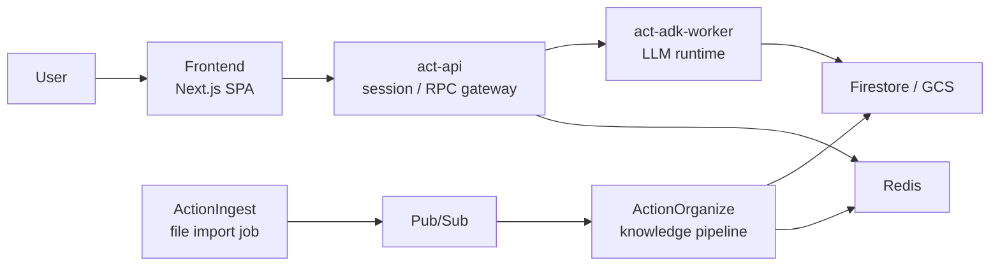
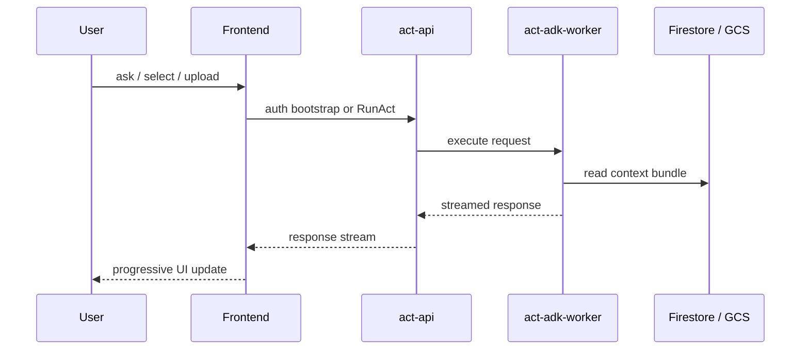

# Action Architecture Overview

このドキュメントは、Action を初めて見る人向けの全体説明です。
実装詳細や運用手順ではなく、「何をするシステムか」「データがどう流れるか」「どんな安全性を意識しているか」を短時間で伝えることを目的にしています。

---

## 1. Action がやること

Action は、会話やメモのような情報を取り込み、整理し、必要なときに使える形へ変換するシステムです。

役割は大きく 2 つあります。

- `Organize`
  - 入力された情報を knowledge graph として整理する層です
  - atom 抽出、topic 判定、draft 更新、outline 更新、node 更新を担当します
- `Act`
  - 整理済みの知識を参照しながら、ユーザーの問いに応答したり作業を進めたりする実行層です
  - frontend, act-api, act-adk-worker で構成されます

単純化すると、流れは次の 2 本です。

- `ingest -> organize`
  - 情報を取り込んで構造化する流れ
- `frontend -> act-api -> act-adk-worker`
  - ユーザーの操作や質問に応答する流れ

---

## 2. システム全体像

この構成で分けている理由は明確です。

- ユーザーとの対話と、知識化の非同期パイプラインを分離する
- ingest の重い処理を UI リクエストから切り離す
- セッション管理、LLM 実行、知識構造化を別責務にする

---

## 3. Ingest / Organize の流れ

会話履歴やログを投入したときは、いきなり巨大な 1 件として処理しません。
ActionIngest が正規化と分割を行い、ActionOrganize が知識化を進めます。

```mermaid
flowchart LR
    File["Chat export / log file"]
    Normalize["ActionIngest<br/>normalize / dedupe / chunk"]
    Topic["Pub/Sub<br/>organize.ingest.received"]
    Receive["Organize intake"]
    Atomize["A1 Atomize"]
    Resolve["A2 Topic Resolve"]
    Draft["Draft / Bundle / Outline"]
    Node["Node update"]
    Data["Firestore / GCS"]

    File --> Normalize --> Topic --> Receive --> Atomize --> Resolve --> Draft --> Node --> Data
```

人に見せるときの要点は次です。

- 大きな入力をそのまま 1 回の LLM 呼び出しへ投げない
- ingest 側で `normalize`, `dedupe`, `chunk` を済ませる
- organize 側は知識化に集中する
- topic 判定や node 更新は段階的に進み、進捗を追跡できる
- Firestore と GCS に中間成果物と最終成果物を残す

この構成により、大きな履歴でも再実行しやすく、失敗時の再送や追跡もしやすくなります。

---

## 4. Act の流れ

Act は、整理済みの知識を使ってユーザー操作に応答するための経路です。

各コンポーネントの役割は次のとおりです。

- `frontend`
  - ユーザーが見る SPA
  - グラフ表示、topic activity、ACT 実行の UI を持ちます
- `act-api`
  - 認証済み session を受け持つ API 境界です
  - frontend からのリクエストを受け、worker に中継します
- `act-adk-worker`
  - LLM 実行担当です
  - Firestore / GCS から必要な context を集め、モデルに渡します

この分離により、frontend は UI に集中し、認証やセッション管理は act-api、LLM 実行は worker が受け持ちます。

---

## 5. セキュリティの考え方

公開向けに説明するなら、Action のセキュリティは「秘密を置く場所を分ける」「公開境界を明確にする」「内部処理を直接さらさない」の 3 点に整理できます。

### 5.1 公開境界

- `frontend` は公開 UI です
- `act-api` は公開 API ですが、認証済み session を前提にします
- `act-adk-worker` と `organize` は内部サービスとして扱います
- ingest や organize の内部イベントを frontend が直接読む前提にはしません

### 5.2 認証とセッション

- ユーザーは Firebase Auth で認証します
- `POST /auth/session/bootstrap` で `sid` と `csrf_token` を発行し、その後の API 呼び出しに使います
- state-changing request では CSRF 対策を前提にします

### 5.3 秘密情報の分離

- API key や内部認証情報は frontend bundle に入れません
- サーバー側シークレットは Secret Manager や実行環境の secret 注入で扱います
- 公開してよい frontend 設定は JSON config で分離します

### 5.4 内部通信の扱い

- worker や organize は外部公開前提にしません
- Redis や内部 API は閉じた経路から使います
- ingest / organize の処理は Pub/Sub と内部ストレージ経由でつなぎます

### 5.5 運用上の原則

- 必須環境変数がない場合は起動時に失敗させます
- fallback で曖昧に起動しない方針です
- 権限は広く配らず、役割ごとに分けます

---

## 6. なぜこの構成なのか

この構成は、単にサービスを分けるためではなく、次の性質を両立するためです。

- UI 応答性
  - ユーザー操作と重い ingest 処理を分離する
- 再実行性
  - 大きな入力を chunk 単位で扱える
- 追跡性
  - topic 判定や更新段階を進捗として観測できる
- 安全性
  - 認証、実行、知識化の責務を分離できる
- 拡張性
  - ingest、organize、act を個別に改善しやすい

---

## 7. どこを読むと深掘りできるか

- ローカル起動と全体セットアップ: [README.md](/home/unix/Action/README.md)
- 本番デプロイと運用: [DEPLOYMENT.md](/home/unix/Action/DEPLOYMENT.md)
- Frontend の詳細仕様: [ActionAct/frontend/frontend-spec.md](/home/unix/Action/ActionAct/frontend/frontend-spec.md)
- Organize ingest 設計: [ActionOrganize/docs/organize-ingest-llm-architecture.md](/home/unix/Action/ActionOrganize/docs/organize-ingest-llm-architecture.md)
- Ingest から Organize までの詳細フロー: [ActionOrganize/docs/ingest-organize-flow.md](/home/unix/Action/ActionOrganize/docs/ingest-organize-flow.md)
- Terraform 構成: [terraform/REFACTORING.md](/home/unix/Action/terraform/REFACTORING.md)
