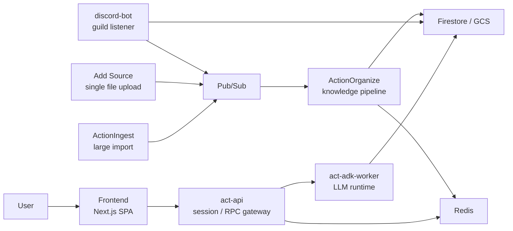
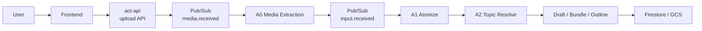
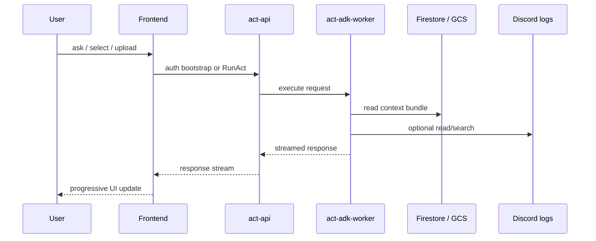
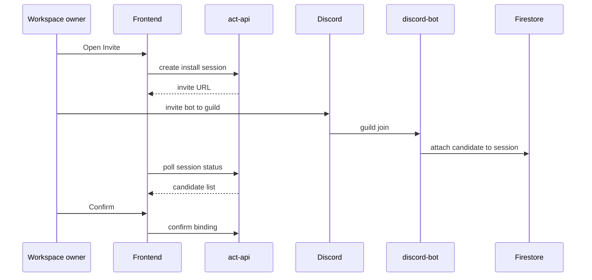
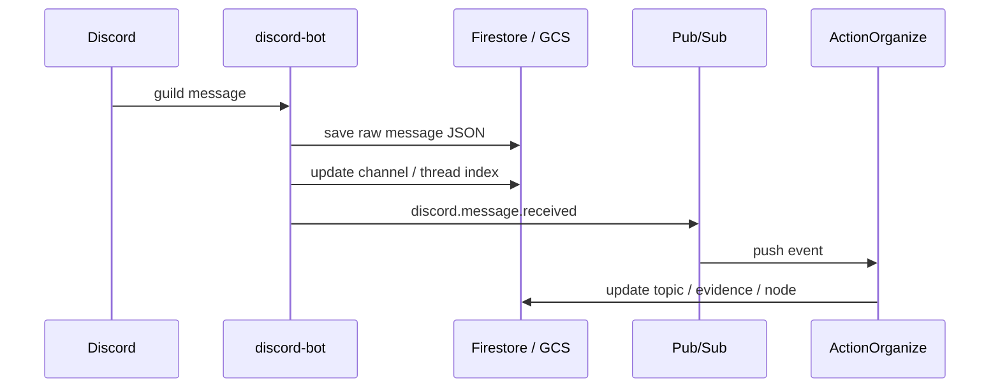
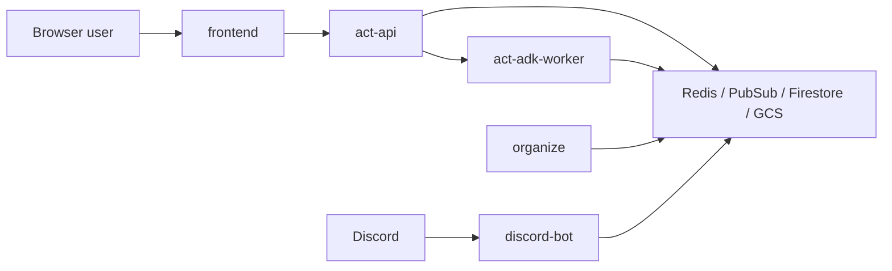

# Architecture Diagrams

このページは、Action の構成と主要フローを図としてまとめた資料です。
細かい仕様説明は省き、構成と流れを短く参照できることを優先しています。

## 1. System Overview

Notes:

- 最初の全体説明
- 「何のサービスがあるのか」を短く示したいとき

## 2. Large Import Flow

```mermaid
flowchart LR
    File["Chat export / log file"]
    Normalize["ActionIngest<br/>normalize / dedupe / chunk"]
    Topic["Pub/Sub<br/>organize.ingest.received"]
    Receive["Organize bridge"]
    Atomize["A1 Atomize"]
    Resolve["A2 Topic Resolve"]
    Draft["Draft / Bundle / Outline"]
    Node["Node update"]
    Data["Firestore / GCS"]

    File --> Normalize --> Topic --> Receive --> Atomize --> Resolve --> Draft --> Node --> Data
```

Notes:

- `ActionIngest` の役割説明
- 大きい入力をどう扱うかの説明

## 3. Add Source Flow

Notes:

- UI からの file 追加がどう知識化されるか
- `ActionIngest` とは別入口であることの説明

## 4. Act Runtime Flow

Notes:

- UI, API, worker の責務分離説明
- streaming response の説明

## 5. Discord Integration Flow

Notes:

- Discord connect が半自動 confirm であることの説明
- 安全性と UX のバランス説明

## 6. Discord Message Ingestion

Notes:

- Discord が単なる bot demo ではなく knowledge pipeline に入ることの説明

## 7. Security Boundary

Notes:

- public / internal boundary の説明
- secret や internal service をどう閉じているかの説明

## 8. Diagram Set

このページにある図は、それぞれ独立して参照できます。
全体構成を先に見る場合は `System Overview`、実行系を見る場合は `Act Runtime Flow`、入力経路を見る場合は `Large Import Flow` と `Add Source Flow`、外部連携を見る場合は `Discord Integration Flow` と `Discord Message Ingestion` を参照してください。
