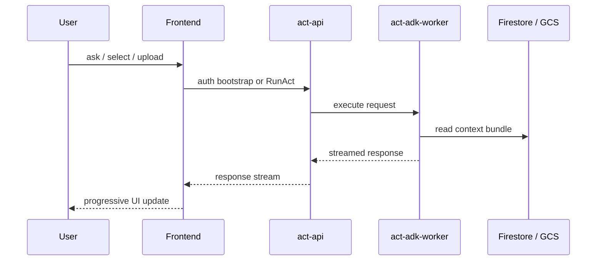

# Act Runtime Flow

Act は、整理済みの知識を使ってユーザーの操作や質問に応答する経路です。
frontend, act-api, act-adk-worker が役割分担して動きます。

## フロー

## 各コンポーネントの役割

- `frontend`
  - ユーザーが見る SPA です
  - グラフ表示、topic activity、ACT 実行の UI を持ちます
- `act-api`
  - 認証済み session を受け持つ API 境界です
  - frontend からのリクエストを受け、worker に中継します
- `act-adk-worker`
  - LLM 実行担当です
  - Firestore / GCS から必要な context を集め、モデルに渡します

## この分離の意図

- frontend は UI とユーザー体験に集中する
- act-api は認証、セッション、API 境界を引き受ける
- act-adk-worker は推論と context assembly に集中する

## 人に見せるときの一言説明

Action の対話系は、画面、認証付き API、LLM 実行 worker を分けています。
これにより、UI の更新速度、認証管理、モデル実行を別々に改善しやすくしています。

## 関連資料

- Act API: [ActionAct/act-api/README.md](/home/unix/Action/ActionAct/act-api/README.md)
- ADK Worker: [ActionAct/act-adk-worker/README.md](/home/unix/Action/ActionAct/act-adk-worker/README.md)
- Frontend 仕様: [frontend-spec.md](/home/unix/Action/ActionAct/frontend/frontend-spec.md)
