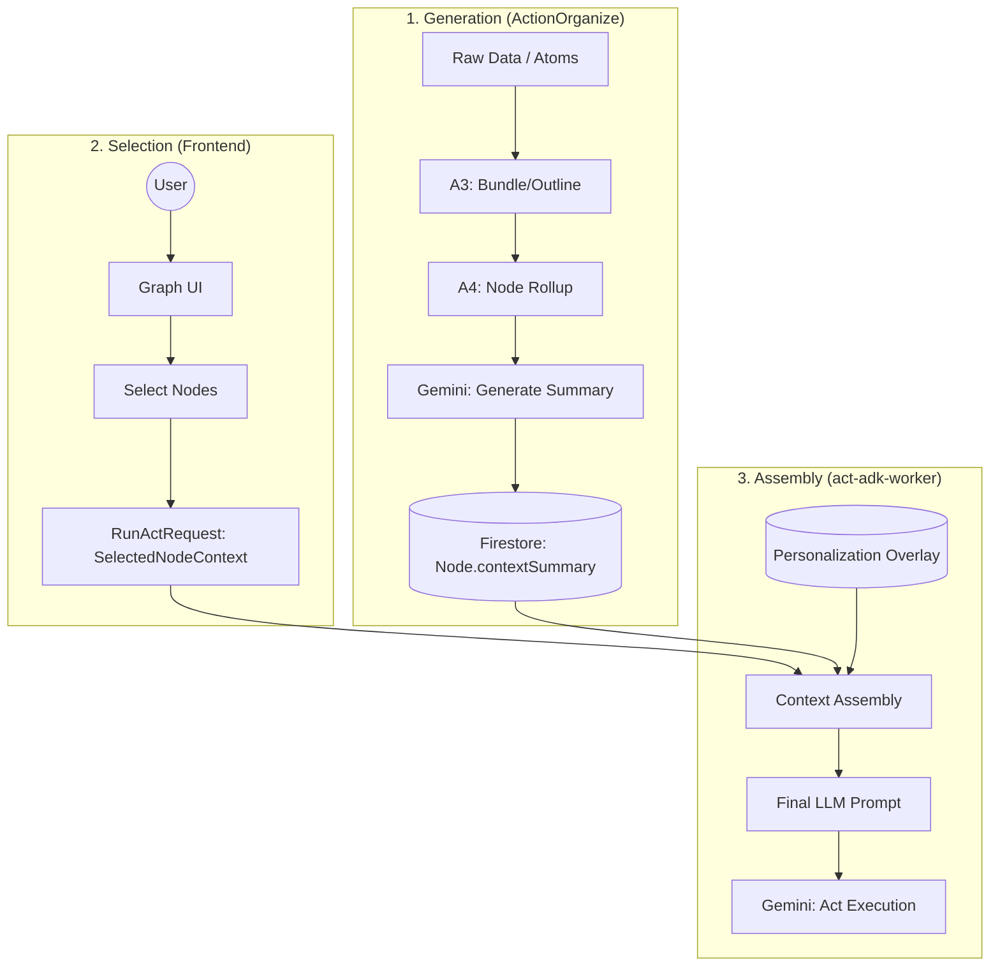
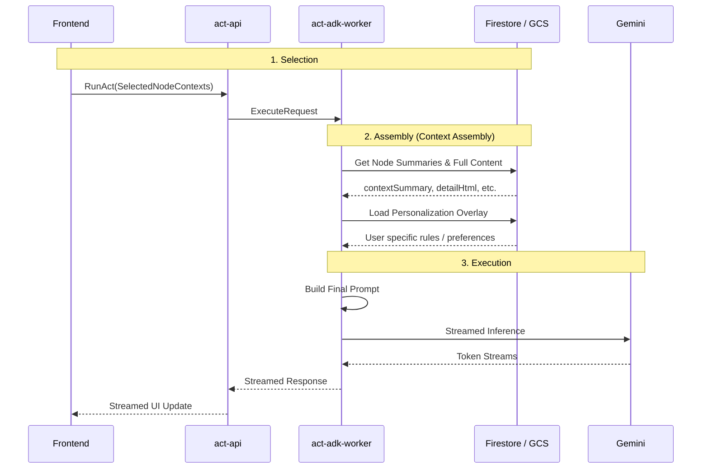

# Context Management Flow

Action における「コンテクスト（Context）」は、知識グラフ上のノード、ユーザーのセッション情報、およびパーソナライズ情報を LLM が理解可能な形に統合する仕組みです。

---

## 1. Context ライフサイクル概要

コンテクストは、「生成」「選択」「組み立て」の 3 つのフェーズを経て LLM に渡されます。

---

## 2. 各フェーズの詳細

### 2-A. Generation (ActionOrganize)
知識化パイプラインの最終段階で、各ノードの「要約」が生成されます。

- **処理主体**: `NodeRollupHandler` / `PipelineWriteService`
- **内容**: 
    - 子ノードの `contextSummary` を集約し、Gemini (Quality) を用約。
    - `contextSummary`: プロンプト埋め込み用の 1-2 文のプレーンテキスト。
    - `detailHtml`: UI 表示および詳細参照用の HTML。
- **保存先**: Firestore `nodes` コレクション의 `contextSummary` フィールド。

### 2-B. Selection (Frontend)
ユーザーの操作や実行時の必要性に応じて、どの知識を LLM に渡すべきかが決定されます。

- **処理主体**: Frontend (`GraphNodeCard`, `act-runner`)
- **内容**: 
    - ユーザーがグラフ上で選択したノード。
    - 実行中のコンテクストに基づき自動選択された関連ノード。
    - `SelectedNodeContext` 型として `act-api` へ送信。

### 2-C. Assembly (act-adk-worker)
実行エンジンが、バラバラの情報を 1 つの「プロンプト」として統合します。

- **処理主体**: `act-adk-worker` (`FirestoreAssembly`)
- **内容**: 
    1. **Node Content Load**: `node_ids` に基づき、Firestore/GCS から正本データを読み込み。
    2. **Overlay Application**: ユーザーごとの `personalization/overlay` を適用（トピックの解釈変更など）。
    3. **Prompt Rendering**: Markdown 形式などで LLM 用の指示と知識を連結。
- **最終出力**: LLM (Gemini) への Input Message。

---

## 3. コンテクスト組み立てのシーケンス

---

## 4. 関連リソース

- **Schema**: `contracts/act/v1/act.proto` (`SelectedNodeContext`)
- **Logic (Gen)**: `ActionOrganize/src/services/pipeline-write-service.ts`
- **Logic (Assembly)**: `ActionAct/act-adk-worker/app/adapter/firestore_assembly.py`
- **Personalization**: `docs/concepts/personalization-overlay.md` (TBD)
