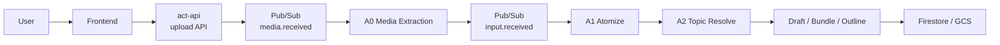

# Ingest / Organize Flow

Action で情報を知識化する入口は 2 本あります。

- `ActionIngest`
  - chat export や大きなログをまとめて前処理する入口です
- `Add Source`
  - frontend から単発ファイルを追加する入口です

どちらも最終的には Organize に入り、段階的に知識化されます。

## 1. Large Import Flow

```mermaid
flowchart LR
    File["Chat export / log file"]
    Normalize["ActionIngest<br/>normalize / dedupe / chunk"]
    Topic["Pub/Sub<br/>organize.ingest.received"]
    Receive["Organize bridge"]
    Atomize["A1 Atomize"]
    Resolve["A2 Topic Resolve"]
    Draft["Draft / Bundle / Outline"]
    Node["Node update"]
    Data["Firestore / GCS"]

    File --> Normalize --> Topic --> Receive --> Atomize --> Resolve --> Draft --> Node --> Data
```

### 各段階でやっていること

1. `ActionIngest`
   - 入力ファイルを読み込みます
   - message を正規化します
   - 重複を除去します
   - 再実行しやすい単位に chunk 分割します
2. `Pub/Sub`
   - chunk ごとの job を非同期で運びます
   - ingest と organize を疎結合に保ちます
3. `ActionOrganize`
   - 受信した chunk を knowledge 化します
   - atom 抽出、topic 判定、draft 更新、outline 更新、node 更新を段階的に進めます
4. `Firestore / GCS`
   - 中間成果物と最終成果物を保存します
   - 進捗や lineage を追えるようにします

## 2. Add Source Flow

単発の PDF、画像、資料ファイルを UI から追加する場合は、`ActionIngest` を通りません。
frontend と `act-api` が upload を受け持ち、A0 が text 抽出を行ったうえで canonical な `input.received` へ橋渡しします。

### 役割分担

1. `frontend`
   - `Add Source` から file upload を開始します
2. `act-api`
   - upload URL を払い出します
   - upload 完了を記録し、`media.received` を publish します
3. `A0`
   - raw media から text を抽出します
   - Organize の canonical event である `input.received` に変換します
4. `A1` 以降
   - 以後は通常の Organize パイプラインに入ります

## この構成を採る理由

- 大きな入力をそのまま 1 回の LLM 呼び出しへ投げない
- ingest 側で `normalize`, `dedupe`, `chunk` を済ませる
- 単発ファイル追加では `ActionIngest` を経由せず、軽い UI 導線を保つ
- ただし Organize 内部の canonical event は `input.received` にそろえる
- organize 側は知識化に集中する
- topic 判定や node 更新を段階的に追跡できる
- 失敗時の再送や再処理をしやすくする

## 人に見せるときの一言説明

Action は、重い履歴取り込みと単発ファイル追加を別入口にしつつ、内部では同じ Organize パイプラインへ寄せています。
そのため、UI の使いやすさと知識化パイプラインの一貫性を両立しやすくしています。

## 詳細仕様

- 詳細設計: [organize-ingest-llm-architecture.md](/home/unix/Action/ActionOrganize/docs/organize-ingest-llm-architecture.md)
- 詳細フロー: [ingest-organize-flow.md](/home/unix/Action/ActionOrganize/docs/ingest-organize-flow.md)
