# Ingest / Organize Flow

会話履歴やログを投入したときは、巨大な入力を 1 回で処理しません。
ActionIngest が前処理を行い、ActionOrganize が知識化を段階的に進めます。

## フロー

```mermaid
flowchart LR
    File["Chat export / log file"]
    Normalize["ActionIngest<br/>normalize / dedupe / chunk"]
    Topic["Pub/Sub<br/>organize.ingest.received"]
    Receive["Organize intake"]
    Atomize["A1 Atomize"]
    Resolve["A2 Topic Resolve"]
    Draft["Draft / Bundle / Outline"]
    Node["Node update"]
    Data["Firestore / GCS"]

    File --> Normalize --> Topic --> Receive --> Atomize --> Resolve --> Draft --> Node --> Data
```

## 各段階でやっていること

1. `ActionIngest`
   - 入力ファイルを読み込みます
   - message を正規化します
   - 重複を除去します
   - 再実行しやすい単位に chunk 分割します
2. `Pub/Sub`
   - chunk ごとの job を非同期で運びます
   - ingest と organize を疎結合に保ちます
3. `ActionOrganize`
   - 受信した chunk を knowledge 化します
   - atom 抽出、topic 判定、draft 更新、outline 更新、node 更新を段階的に進めます
4. `Firestore / GCS`
   - 中間成果物と最終成果物を保存します
   - 進捗や lineage を追えるようにします

## この構成を採る理由

- 大きな入力をそのまま 1 回の LLM 呼び出しへ投げない
- ingest 側で `normalize`, `dedupe`, `chunk` を済ませる
- organize 側は知識化に集中する
- topic 判定や node 更新を段階的に追跡できる
- 失敗時の再送や再処理をしやすくする

## 人に見せるときの一言説明

Action は、会話履歴をまず扱いやすい小さな単位に分割し、その後に知識グラフへ段階的に反映します。
そのため、大きな入力でも処理の見通しが立ちやすく、再実行や追跡にも向いています。

## 詳細仕様

- 詳細設計: [organize-ingest-llm-architecture.md](/home/unix/Action/ActionOrganize/docs/organize-ingest-llm-architecture.md)
- 詳細フロー: [ingest-organize-flow.md](/home/unix/Action/ActionOrganize/docs/ingest-organize-flow.md)
