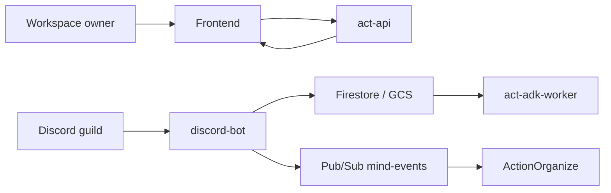
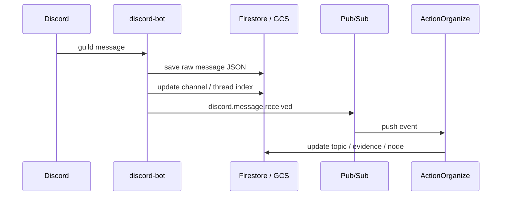

# Discord Integration

Action には、Discord の guild を workspace に接続するための integration があります。
役割は 2 つです。

- Discord 上の会話を継続的に取り込む
- Act から保存済み Discord ログを参照できるようにする

## 全体像

## 接続フロー

workspace owner は frontend から Discord bot を接続します。

1. `Open Invite`
   - frontend が `act-api` に install session 作成を依頼します
   - `act-api` は Discord invite URL を返します
2. Discord で bot を guild に招待
   - `discord-bot` は `guild join` を検知します
3. 候補の提示
   - bot は pending install session に guild 候補を記録します
   - frontend は候補一覧を表示します
4. `Confirm`
   - owner が候補を 1 回確認して確定します
   - `workspaces/{workspaceId}/integrations/discord`
   - `discord_guild_bindings/{guildId}`
   を更新します

このフローは完全自動ではなく、最後だけ owner 確認を残す半自動方式です。
誤って別 workspace に guild を結びつけるリスクを下げるためです。

## メッセージ取り込みフロー

接続が完了すると、Discord 上の新規メッセージは次の流れで処理されます。

`discord-bot` は live の Discord API に接続する常駐プロセスです。
各 message を GCS に保存し、Firestore に channel / thread index を書き、`discord.message.received` を publish します。

## Act からの参照

Act の実行時には、`act-adk-worker` が保存済み Discord ログを tool として参照できます。

- channel / thread 一覧を見る
- 特定 channel / thread の message を読む
- 保存済み message を検索する

これは live の Discord API 呼び出しではなく、GCS / Firestore に保存済みのログ参照です。

## Summary

Action は Discord を workspace に接続し、会話を継続的に取り込みます。
取り込んだログは Organize で知識化され、Act からも保存済み履歴として再利用できます。
