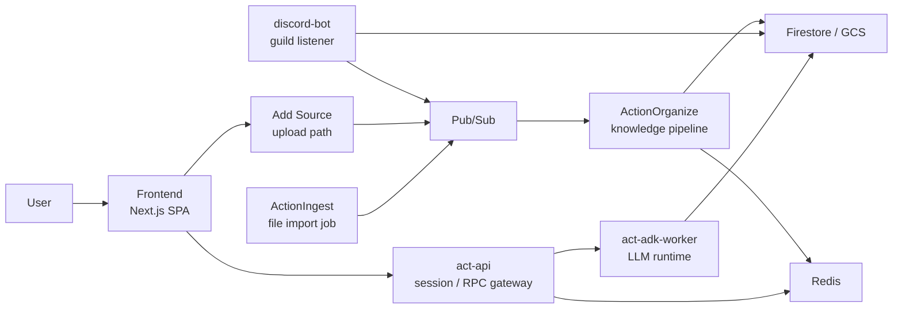

# Action Overview

Action は、会話やメモのような情報を取り込み、整理し、必要なときに使える形へ変換するシステムです。

役割は大きく 2 つあります。

- `Organize`
  - 入力された情報を knowledge graph として整理する層です
  - atom 抽出、topic 判定、draft 更新、outline 更新、node 更新を担当します
- `Act`
  - 整理済みの知識を参照しながら、ユーザーの問いに応答したり作業を進めたりする実行層です
  - frontend, act-api, act-adk-worker で構成されます

単純化すると、流れは次の 3 本です。

- `ingest -> organize`
  - 情報を取り込んで構造化する流れ
- `add source -> media.received -> input.received -> organize`
  - UI から単発ファイルを追加して知識化する流れ
- `frontend -> act-api -> act-adk-worker`
  - ユーザーの操作や質問に応答する流れ

## 全体像

この構成で分けている理由は次のとおりです。

- ユーザーとの対話と、知識化の非同期パイプラインを分離する
- 重い ingest と、単発の Add Source を別入口に分ける
- セッション管理、LLM 実行、知識構造化を別責務にする
- 外部連携として Discord を追加しても、知識化の入口をそろえられる

## この構成で得たい性質

- UI 応答性
  - ユーザー操作と重い ingest 処理を分離する
- 再実行性
  - 大きな入力を chunk 単位で扱える
- 追跡性
  - topic 判定や更新段階を進捗として観測できる
- 安全性
  - 認証、実行、知識化の責務を分離できる
- 拡張性
  - ingest、Add Source、Discord、act を個別に改善しやすい

## 次に読むもの

- ingest 系の説明: [Ingest / Organize Flow](./flows/ingest-organize.md)
- Act 系の説明: [Act Runtime Flow](./flows/act-runtime.md)
- セキュリティ説明: [Security Overview](./security.md)
