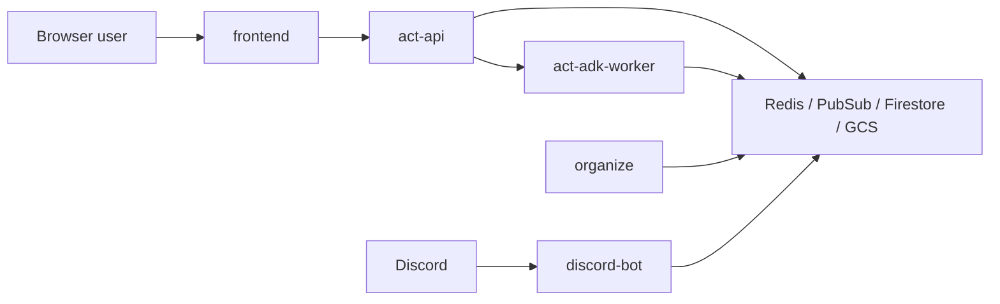

# Security Overview

Action のセキュリティは次の 3 点で整理できます。

- 秘密を置く場所を分ける
- 公開境界を明確にする
- 内部処理を直接さらさない

## 公開境界

- `frontend` は公開 UI です
- `act-api` は公開 API ですが、認証済み session を前提にします
- `act-adk-worker` と `organize` は内部サービスとして扱います
- `discord-bot` は外部の Discord と接続する常駐 worker ですが、公開 HTTP API は持ちません
- ingest や organize の内部イベントを frontend が直接読む前提にはしません

## システム境界

公開境界は `frontend` と `act-api` です。
`act-adk-worker`, `organize`, `discord-bot`, Redis, Pub/Sub は内部面に寄せます。

## 認証とセッション

- ユーザーは Firebase Auth で認証します
- `POST /auth/session/bootstrap` で `sid` と `csrf_token` を発行し、その後の API 呼び出しに使います
- state-changing request では CSRF 対策を前提にします
- Discord 接続の確定は workspace owner の操作に限定します

## 秘密情報の分離

- API key や内部認証情報は frontend bundle に入れません
- サーバー側シークレットは Secret Manager や実行環境の secret 注入で扱います
- 公開してよい frontend 設定は JSON config で分離します
- Discord bot token は frontend や公開 API に露出させません

## 内部通信の扱い

- worker や organize は外部公開前提にしません
- Redis や内部 API は閉じた経路から使います
- ingest / organize の処理は Pub/Sub と内部ストレージ経由でつなぎます
- Discord bot は Firestore の guild binding を参照して workspace を解決します

## 運用上の原則

- 必須環境変数がない場合は起動時に失敗させます
- fallback で曖昧に起動しない方針です
- 権限は広く配らず、役割ごとに分けます
- workspace と guild の紐付けは確認付きで確定し、勝手に自動確定しません

## Summary

Action は、公開 UI と内部処理を分離し、認証済み API を境界に置く構成です。
秘密情報は frontend に載せず、内部サービスやシークレット管理基盤で扱います。
